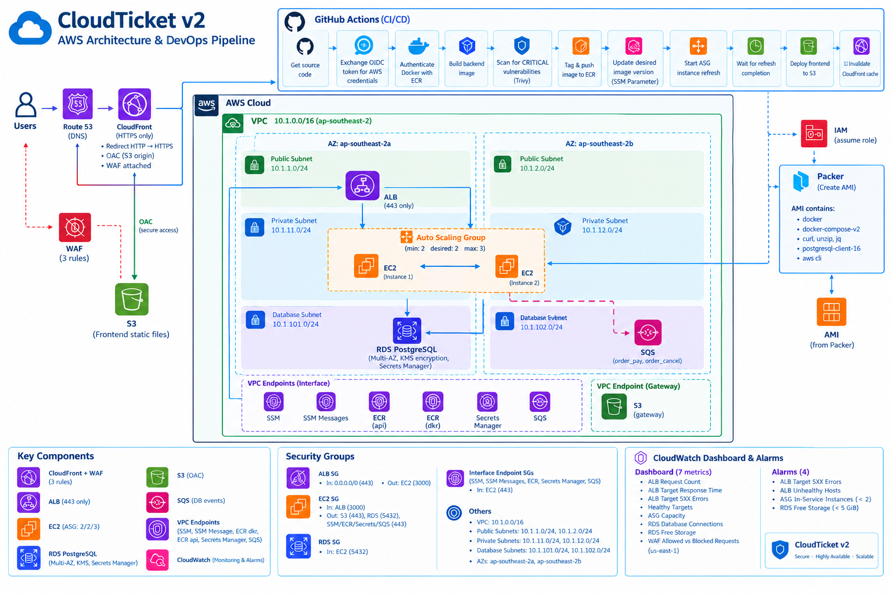

# CloudTicket V2

## AWS Cloud / DevOps / Cloud Security Portfolio Project

CloudTicket V2 is a portfolio project focused on designing and automating a secure, highly available AWS cloud architecture using Terraform, Packer, GitHub Actions and AWS managed services.

The project demonstrates practical experience across:

* AWS cloud infrastructure and networking
* Infrastructure as Code with Terraform
* Machine image automation with Packer
* CI/CD with GitHub Actions
* GitHub OIDC and least-privilege IAM
* Containerized application deployment with Docker and Amazon ECR
* Private networking with VPC endpoints
* Application security with CloudFront, WAF, TLS and Security Groups
* High availability using ALB, Auto Scaling and RDS Multi-AZ
* Operational visibility with Amazon CloudWatch

> **Portfolio focus:** Cloud / DevOps / Cloud Security rather than application complexity.

---

## Architecture

The architecture is designed around a secure and highly available AWS deployment across two Availability Zones in `ap-southeast-2`.



### Request Flow

```text
User
  │
  │ HTTPS
  ▼
CloudFront
  │
  ├── /           → S3 static frontend
  │                   └── S3 OAC
  │
  └── /api/*      → ALB
                      │
                      │ HTTPS :443
                      ▼
                  Target Group
                      │
                      ▼
                  EC2 / ASG
                      │
                      ├── PostgreSQL :5432
                      │       │
                      │       ▼
                      │     RDS
                      │
                      └── AWS services
                          through VPC Endpoints
```

CloudFront is the public entry point for browser traffic and enforces HTTPS for client connections. The `/api/*` path is routed to the Application Load Balancer over HTTPS.

The ALB terminates the HTTPS connection on port `443` and forwards application traffic to EC2 targets on port `3000`.

The EC2 instances run in private subnets and access AWS services through VPC endpoints rather than requiring a NAT Gateway.

---

## AWS Infrastructure

### Networking

The AWS environment is deployed in a VPC with CIDR:

```text
10.1.0.0/16
```

The architecture spans two Availability Zones:

```text
ap-southeast-2a
ap-southeast-2b
```

Subnet layout:

| Subnet type | AZ 1            | AZ 2            |
| ----------- | --------------- | --------------- |
| Public      | `10.1.1.0/24`   | `10.1.2.0/24`   |
| Private     | `10.1.11.0/24`  | `10.1.12.0/24`  |
| Database    | `10.1.101.0/24` | `10.1.102.0/24` |

Public subnets host the Application Load Balancer.

Private subnets host the EC2 application instances managed by the Auto Scaling Group.

Database subnets are used by Amazon RDS PostgreSQL.

---

## Core AWS Services

| Area            | Services                                     |
| --------------- | -------------------------------------------- |
| Edge / Delivery | CloudFront, WAF, Route 53, ACM               |
| Compute         | EC2, Auto Scaling, Application Load Balancer |
| Database        | Amazon RDS PostgreSQL                        |
| Storage         | Amazon S3                                    |
| Containers      | Docker, Amazon ECR                           |
| Messaging       | Amazon SQS                                   |
| Operations      | AWS Systems Manager, CloudWatch              |
| Security        | IAM, KMS, Secrets Manager, Security Groups   |
| Networking      | VPC, subnets, routing, VPC endpoints         |
| Infrastructure  | Terraform, Packer                            |
| CI/CD           | GitHub Actions, GitHub OIDC                  |

---

# Infrastructure as Code

## Terraform

The AWS infrastructure is provisioned using modular Terraform configuration.

The project separates infrastructure into reusable modules covering areas such as:

* Networking
* Security Groups
* KMS
* ECR
* SQS
* IAM
* VPC endpoints
* EC2
* RDS
* S3
* CloudFront
* ACM
* ALB
* Auto Scaling
* WAF
* CloudWatch

Terraform is responsible for provisioning and managing the AWS infrastructure.

The configuration is version controlled in Git, making infrastructure changes reproducible and reviewable.

### Terraform design principles

* Modular infrastructure
* Reusable variables and outputs
* Environment-aware resource naming
* Explicit security-group relationships
* Separation of infrastructure concerns
* Version-controlled infrastructure changes

---

# Machine Image Automation

## Packer

Packer is used to build a custom Ubuntu 24.04 AMI for the EC2 application instances.

The AMI includes the base software required by the application hosts, including:

* Docker
* Docker Compose v2
* AWS CLI
* `curl`
* `unzip`
* `jq`
* PostgreSQL client 16

The resulting AMI is referenced by the EC2 Launch Template used by the Auto Scaling Group.

### Terraform vs Packer

The project deliberately separates these responsibilities:

```text
Packer
   │
   └── Builds the machine image / AMI

Terraform
   │
   └── Provisions the infrastructure using that AMI
```

This keeps machine-image creation separate from infrastructure provisioning.

---

# CI/CD

## GitHub Actions

GitHub Actions provides the application CI/CD pipeline.

The deployment workflow includes:

1. Get source code
2. Exchange GitHub OIDC token for AWS credentials
3. Authenticate Docker with Amazon ECR
4. Build the backend Docker image
5. Scan the image for CRITICAL vulnerabilities with Trivy
6. Tag the Docker image
7. Push the image to Amazon ECR
8. Update the desired backend image version
9. Start an Auto Scaling Group instance refresh
10. Wait for the instance refresh to complete
11. Deploy frontend files to Amazon S3
12. Invalidate the CloudFront cache

This separates application delivery from infrastructure provisioning.

Terraform manages the AWS infrastructure, while GitHub Actions manages application build and deployment activities.

---

## GitHub OIDC

The GitHub Actions workflow uses AWS IAM OIDC federation instead of storing long-lived AWS access keys in GitHub.

The trust relationship allows the GitHub Actions workflow to assume the deployment IAM role using a short-lived federated identity.

```text
GitHub Actions
      │
      │ OIDC
      ▼
AWS IAM Role
      │
      ▼
Temporary AWS credentials
      │
      ├── ECR
      ├── S3
      ├── CloudFront
      └── Auto Scaling / deployment operations
```

This removes the need for long-lived AWS access keys in GitHub repository secrets.

---

# Container Deployment

The backend application is packaged as a Docker image and stored in Amazon ECR.

```text
Source Code
    │
    ▼
GitHub Actions
    │
    ├── Docker Build
    ├── Trivy Scan
    └── Push
          │
          ▼
        ECR
          │
          ▼
     EC2 instances
```

The EC2 hosts use the custom Packer AMI and retrieve the desired backend image version from the deployment configuration.

The Auto Scaling Group uses an EC2 Launch Template based on the Packer-built AMI.

Application updates are rolled out through an Auto Scaling Group instance refresh.

---

# Security

Security is incorporated throughout the architecture rather than added as a separate layer at the end.

## Identity and Access Management

* Least-privilege IAM policies
* GitHub Actions OIDC federation
* No long-lived AWS credentials stored in GitHub Actions
* Separate IAM roles for AWS workloads and CI/CD

## Network Security

The application instances run in private subnets.

Security Groups restrict communication between architectural layers.

```text
Internet
   │
   │ HTTPS :443
   ▼
ALB
   │
   │ TCP :3000
   ▼
EC2
   │
   ├── TCP :5432 ──► RDS
   │
   └── TCP :443 ───► VPC Endpoints
```

The RDS Security Group only permits PostgreSQL traffic from the EC2 Security Group.

EC2 access to SSM, ECR, Secrets Manager and SQS is restricted to HTTPS `443` through their respective VPC interface endpoints.

S3 access uses the S3 Gateway Endpoint.

---

## Private AWS Service Access

The private EC2 instances use VPC endpoints to access required AWS services without requiring a NAT Gateway.

### Interface endpoints

* Systems Manager
* Systems Manager Messages
* Amazon ECR API
* Amazon ECR Docker Registry
* AWS Secrets Manager
* Amazon SQS

### Gateway endpoint

* Amazon S3

This design reduces public network exposure and avoids the additional cost and complexity of a NAT Gateway for this portfolio environment.

---

# Encryption and Secrets

## KMS

Amazon RDS uses AWS KMS encryption for data at rest.

The EC2 root volumes are also configured for encryption.

## Secrets Manager

RDS database credentials are managed through AWS Secrets Manager rather than being hard-coded into application configuration.

This provides a dedicated secret-management mechanism for database credentials.

---

# Edge Security

## CloudFront

CloudFront provides the public content delivery layer.

It serves:

* Static frontend content from Amazon S3
* API traffic through the Application Load Balancer

CloudFront uses an Origin Access Control (OAC) to securely access the S3 origin.

Client HTTP requests are redirected to HTTPS at the CloudFront layer.

The CloudFront-to-ALB connection also uses HTTPS.

---

## AWS WAF

AWS WAF is attached to the CloudFront distribution.

The Web ACL contains three rules:

* AWS Managed Rules — Common Rule Set
* AWS Managed Rules — Known Bad Inputs Rule Set
* Rate-based rule

This provides a combination of managed application-layer protection and request-rate control.

---

# High Availability

The architecture uses multiple Availability Zones.

### Application tier

The Application Load Balancer distributes traffic to EC2 instances managed by an Auto Scaling Group.

The Auto Scaling Group is configured with:

```text
Minimum: 2
Desired: 2
Maximum: 3
```

This provides multiple application instances and allows the group to replace or add instances when required.

### Database tier

Amazon RDS PostgreSQL is deployed using Multi-AZ.

The RDS configuration provides a standby instance in another Availability Zone for managed database failover.

> Multi-AZ improves database availability and failover capability. It should not be interpreted as a complete disaster-recovery strategy.

---

# Messaging

## Amazon SQS

CloudTicket V2 publishes order-related events to Amazon SQS after relevant database transactions.

Current event types include:

```text
order_pay
order_cancel
```

The queue provides asynchronous event publishing and decouples event delivery from the main request flow.

The current version focuses on event publishing / queuing. A dedicated message consumer is not part of this version.

---

# Observability

## Amazon CloudWatch

CloudWatch provides operational visibility across the main application components.

The project includes a CloudWatch dashboard containing metrics for:

* ALB Request Count
* ALB Target Response Time
* ALB Target 5XX Errors
* Healthy Targets
* ASG Capacity
* RDS Database Connections
* RDS Free Storage
* WAF Allowed vs Blocked Requests

WAF metrics are monitored in `us-east-1` because the Web ACL is associated with the CloudFront distribution.

### CloudWatch alarms

The project includes alarms for:

| Alarm                    | Condition                             |
| ------------------------ | ------------------------------------- |
| ALB Target 5XX           | Backend returns 5XX responses         |
| ALB Unhealthy Hosts      | One or more targets become unhealthy  |
| ASG In-Service Instances | Fewer than 2 instances are in service |
| RDS Free Storage         | Free storage falls below 5 GiB        |

These alarms provide basic detection of application, compute and database health issues.

---

# Screenshots / Evidence

The repository contains screenshots documenting the implementation and AWS resources.

## AWS Architecture

* CloudFront
* WAF
* ALB
* Auto Scaling
* EC2
* RDS
* S3
* VPC endpoints

## Infrastructure

* Terraform module structure
* Terraform plan
* Packer configuration and build output
* Custom AMI

## CI/CD

* GitHub Actions CI
* GitHub Actions CD
* Docker image build and ECR push
* Trivy vulnerability scanning
* Auto Scaling instance refresh

## Security

* GitHub OIDC / IAM trust relationship
* IAM roles and policies
* Security Groups
* WAF configuration
* KMS / Secrets Manager

## Observability

* CloudWatch dashboard
* CloudWatch alarms

---

# Key Design Decisions

## 1. GitHub OIDC instead of long-lived AWS credentials

GitHub Actions authenticates to AWS through OIDC federation.

**Why:**

* Avoids long-lived AWS access keys
* Reduces credential-management risk
* Uses short-lived AWS credentials
* Provides a stronger CI/CD security model

---

## 2. Private EC2 with VPC endpoints instead of NAT Gateway

Application instances run in private subnets and access required AWS services through VPC endpoints.

**Why:**

* Keeps application instances off the public internet
* Reduces unnecessary public egress
* Avoids NAT Gateway cost for this project
* Demonstrates private AWS networking

---

## 3. SSM instead of SSH

AWS Systems Manager is used for operational access and deployment activities.

**Why:**

* Avoids exposing SSH to the internet
* Removes the need to manage SSH keys for normal operations
* Provides AWS-integrated instance management

---

## 4. Packer AMI + Launch Template

Packer creates the base machine image, while Terraform provisions the Launch Template and Auto Scaling infrastructure.

**Why:**

* Separates image creation from infrastructure provisioning
* Produces a repeatable EC2 baseline
* Simplifies Auto Scaling instance replacement

---

## 5. ALB + Auto Scaling

The Application Load Balancer distributes requests across EC2 targets managed by an Auto Scaling Group.

**Why:**

* Provides multiple application instances
* Supports health-based target management
* Enables controlled instance replacement and refresh

---

## 6. RDS Multi-AZ

RDS PostgreSQL uses Multi-AZ deployment.

**Why:**

* Provides managed database failover
* Improves availability across Availability Zones
* Avoids managing database replication manually

---

## 7. CloudFront + WAF

CloudFront is used as the public edge layer with AWS WAF attached.

**Why:**

* Provides a single public entry point
* Enforces HTTPS for client traffic
* Adds web application-layer protection
* Separates frontend delivery from backend infrastructure

---

# Lessons Learned

CloudTicket V2 was developed as a practical learning project rather than simply a collection of AWS services.

Key areas of learning included:

* Designing AWS VPC and subnet architectures
* Controlling traffic with Security Groups
* Understanding ALB, Target Groups and Auto Scaling relationships
* Implementing private EC2 networking with VPC endpoints
* Managing secrets and encryption in AWS
* Building CI/CD pipelines with GitHub Actions
* Implementing GitHub OIDC authentication
* Separating Terraform infrastructure deployment from application CI/CD
* Building reusable machine images with Packer
* Troubleshooting networking, DNS, TLS, CloudFront and container connectivity
* Adding operational monitoring with CloudWatch
* Applying security considerations throughout the infrastructure lifecycle

---

# Technology Stack

### Cloud

AWS, EC2, VPC, IAM, S3, CloudFront, Route 53, ACM, ALB, Auto Scaling, RDS, SQS, ECR, SSM, Secrets Manager, KMS, WAF, CloudWatch

### Infrastructure as Code

Terraform

### Image Automation

Packer

### CI/CD

GitHub Actions, GitHub OIDC

### Containers

Docker, Docker Compose, Amazon ECR

### Application

Node.js, Express.js, PostgreSQL

### Security

IAM least privilege, Security Groups, private subnets, VPC endpoints, KMS, Secrets Manager, TLS/HTTPS, CloudFront OAC, AWS WAF, Trivy

### Operating Environment

Ubuntu Linux

---

# Project Structure

```text
cloud-ticket-v2/
├── .github/
│   └── workflows/
├── backend/
├── frontend/
├── terraform/
│   └── modules/
├── packer/
├── docs/
│   ├── architecture/
│   └── screenshots/
└── README.md
```

---

# Project Status

CloudTicket V2 is a portfolio and learning project demonstrating AWS Cloud, DevOps and Cloud Security practices.

The project is not intended to represent a production enterprise platform. Infrastructure is provisioned selectively for learning, demonstration and portfolio evidence, with AWS cost considered throughout the design.

---

# What This Project Demonstrates

CloudTicket V2 brings together several areas that are important for a junior Cloud / DevOps / Cloud Security role:

```text
AWS Architecture
       │
       ├── Networking
       ├── Compute
       ├── Storage
       ├── Database
       └── Edge Services
              │
              ▼
Infrastructure as Code
       │
       └── Terraform
              │
              ▼
Image Automation
       │
       └── Packer
              │
              ▼
CI/CD
       │
       └── GitHub Actions + OIDC
              │
              ▼
Security
       │
       ├── IAM
       ├── Private Networking
       ├── Encryption
       ├── Secrets Manager
       └── WAF
              │
              ▼
Observability
       │
       └── CloudWatch
```

The goal of the project is to demonstrate not only how AWS services work individually, but how **cloud infrastructure, automation, security and operations fit together as one system**.


## Author

Zhenyu Tan
